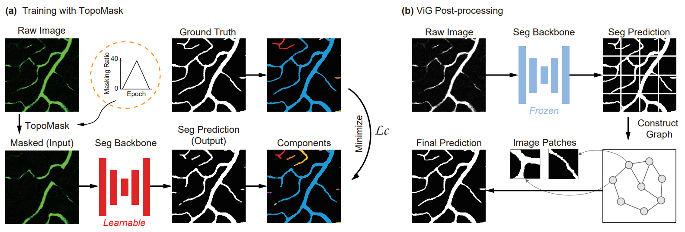

# Masked Vascular-structure Segmentation and Completion in Retinal Images

<center>

</center>

###  [Paper](https://ieeexplore.ieee.org/stamp/stamp.jsp?tp=&arnumber=10887048) | [BibTex](#jump1)

Masked Vascular-structure Segmentation and Completion in Retinal Images<br>

[Yi Zhou](https://scholar.google.com/citations?user=b84ZTLkAAAAJ), [Thiara Sana Ahmed](#jump1), [Meng Wang](https://wangm92nus.github.io/), [Eric A. Newman](https://www2.neuroscience.umn.edu/eanwebsite/index.htm), [Leopold Schmetterer](https://www.singhealth.com.sg/profile/leopold-schmetterer), [Huazhu Fu](https://hzfu.github.io/), [Jun Cheng](https://samjcheng.github.io/), and [Bingyao Tan](https://bingyaotan.github.io/)<br>


### [License](https://https://github.com/Zhouyi-Zura/MaskVSC/blob/main/LICENSE)

All rights reserved.

The code and data are released for academic research use only. For commercial use, please contact [bingyao.tan@duke-nus.edu.sg](mailto:bingyao.tan@duke-nus.edu.sg).

## Abstract

Early retinal vascular changes in diseases such as diabetic retinopathy often occur at a microscopic level. Accurate evaluation of retinal vascular networks at a micro-level could significantly improve our understanding of angiopathology and potentially aid ophthalmologists in disease assessment and management. Multiple angiogram-related retinal imaging modalities, including fundus, optical coherence tomography angiography, and fluorescence angiography, project continuous, inter-connected retinal microvascular networks into imaging domains. However, extracting the microvascular network, which includes arterioles, venules, and capillaries, is challenging due to the limited contrast and resolution. As a result, the vascular network often appears as fragmented segments. In this paper, we propose a backbone-agnostic Masked Vascular Structure Segmentation and Completion (MaskVSC) method to reconstruct the retinal vascular network. MaskVSC simulates missing sections of blood vessels and uses this simulation to train the model to predict the missing parts and their connections. This approach simulates highly heterogeneous forms of vessel breaks and mitigates the need for massive data labeling. Accordingly, we introduce a connectivity loss function that penalizes interruptions in the vascular network. Our findings show that masking 40% of the segments yields optimal performance in reconstructing the interconnected vascular network. We test our method on three different types of retinal images across five separate datasets. The results demonstrate that MaskVSC outperforms state-of-the-art methods in maintaining vascular network completeness and segmentation accuracy. Furthermore, MaskVSC has been introduced to different segmentation backbones and has successfully improved performance.


## Run the code
Using ```train.py``` and ```test.py``` to train and test the Seg model on your own dataset, respectively.

After the Seg model is trained, use ```train_ViG.py``` and ```test_ViG.py``` to train and test the ViG model.

The two-photon fluorescence microscopy (2PFM) data is available at [Figshare](https://figshare.com/articles/dataset/2PFM_dataset_from_MaskVSC/28203014).


## Dataset, Bacbone, and Competing Method Links

| **DRIVE**        | **https://drive.grand-challenge.org/**                    |
| :--------------- | :-------------------------------------------------------- |
| **STARE**        | **http://www.ces.clemson.edu/ahoover/stare/**             |
| **ROSE**         | **https://imed.nimte.ac.cn/dataofrose.html**              |
| **OCTA-500**     | **https://ieee-dataport.org/open-access/octa-500**        |
| **RITE**         | **https://medicine.uiowa.edu/eye/rite-dataset**           |
| **LES-AV**       | **https://figshare.com/articles/dataset/LES-AV_dataset/11857698**|
| **$CS^2$-Net**   | **https://github.com/iMED-Lab/CS-Net**                    |
| **Swin-Unet**    | **https://github.com/HuCaoFighting/Swin-Unet**            |
| **clDice**       | **https://github.com/jocpae/clDice**                      |
| **TopoLoss**     | **https://github.com/HuXiaoling/TopoLoss**                |
| **BettiLoss**    | **https://github.com/nstucki/Betti-matching**             |
| **DMT**          | **https://github.com/HuXiaoling/DMT_loss**                |
| **Gupta et al.** | **https://github.com/Saumya-Gupta-26/struct-uncertainty** |

<span id="jump1"></span>
## Citation
If you use this code for your research, please cite our papers. 
```
@article{zhou2025masked:,
  title={Masked Vascular Structure Segmentation and Completion in Retinal Images},
  author={Zhou, Yi and Ahmed, Thiara Sana and Wang, Meng and Newman, Eric A. and Schmetterer, Leopold and Fu, Huazhu and Cheng, Jun and Tan, Bingyao},
  journal={IEEE Transactions on Medical Imaging},
  year={2025},
  doi={10.1109/TMI.2025.3538336},
  publisher={IEEE}
}
```